# План по выделению общей логики проверки лояльности для plot cards

## Текущая ситуация

1. У нас есть абстрактный класс `CheckLoyaltyAbstractAddon`, который содержит общую логику для проверки лояльности.
2. Аддоны `LadyOfLakeAddon`, `LadyOfSeaAddon` и `WitchAddon` наследуются от этого класса.
3. Карты `ShowNature`, `AreYouTheOne`, `WeFoundYou` и `ShowStrength` должны использовать тот же механизм проверки лояльности.

## Проблема

Текущая реализация `CheckLoyaltyAbstractAddon` тесно связана с аддонами и не может быть легко использована в plot cards. Нам нужно выделить общую логику в отдельный класс, который можно будет использовать как в аддонах, так и в plot cards.

## План решения

### 1. Создание базового класса для проверки лояльности

Создадим новый класс `LoyaltyChecker`, который будет содержать общую логику проверки лояльности:

```typescript
// packages/backend/src/core/game/addons/check-loyalty/loyalty-checker.ts

import { Game, IPlayerInGame } from '@/core/game';
import { TLoyalty, TRoles, TGameStage } from '@avalon/types';
import { CheckLoyaltyHistory } from '@/core/game/addons/check-loyalty/history';

export class LoyaltyChecker {
  game: Game;
  stageToCheck: TGameStage = 'checkLoyalty';
  stageToAnnounce: TGameStage = 'announceLoyalty';

  constructor(game: Game) {
    this.game = game;
  }

  checkLoyalty(executorID: string, ownerOfCheck: IPlayerInGame, selectedPlayer: IPlayerInGame): void {
    if (this.game.stage !== this.stageToCheck) {
      throw new Error(`You cant check loyalty on stage ${this.game.stage}`);
    }

    if (ownerOfCheck.user.id !== executorID) {
      throw new Error(`Only owner of check can check loyalty`);
    }

    if (selectedPlayer === ownerOfCheck) {
      throw new Error(`You can't check your own loyalty`);
    }

    this.game.stage = this.stageToAnnounce;
    this.game.stateObserver.gameStateChanged();
  }

  getLoyalty(executorID: string, ownerOfCheck: IPlayerInGame, selectedPlayer: IPlayerInGame): TLoyalty | TRoles {
    if (this.game.stage !== this.stageToAnnounce) {
      throw new Error(`You cant get loyalty on stage ${this.game.stage}`);
    }

    if (ownerOfCheck.user.id !== executorID) {
      throw new Error(`Only owner of check can get loyalty`);
    }

    return this.calculateLoyalty(selectedPlayer);
  }

  protected calculateLoyalty(selectedPlayer: IPlayerInGame): TLoyalty | TRoles {
    return selectedPlayer.role.visibleLoylaty;
  }

  announceLoyalty(
    executorID: string,
    ownerOfCheck: IPlayerInGame,
    selectedPlayer: IPlayerInGame,
    loyalty: TLoyalty | TRoles,
  ): void {
    if (this.game.stage !== this.stageToAnnounce) {
      throw new Error(`You cant announce loyalty on stage ${this.game.stage}`);
    }

    if (ownerOfCheck.user.id !== executorID) {
      throw new Error(`Only owner of check can announce loyalty`);
    }

    const loyaltyCheck = new CheckLoyaltyHistory(
      ownerOfCheck,
      selectedPlayer,
      loyalty,
      this.getLoyalty(executorID, ownerOfCheck, selectedPlayer),
    );
    this.game.history.push(loyaltyCheck);

    this.updateVisibleRoles(ownerOfCheck, selectedPlayer);
    this.postAnnounceAction(ownerOfCheck, selectedPlayer);
  }

  updateVisibleRoles(owner: IPlayerInGame, selectedPlayer: IPlayerInGame): void {
    const ownerRole = owner.role.role;
    const selectedPlayerRole = selectedPlayer.role.role;

    if (ownerRole === 'percival') {
      if (selectedPlayerRole.startsWith('merlin') || selectedPlayerRole === 'morgana') {
        const merlin = this.game.players.find((player) => player.role.role.startsWith('merlin'));
        const morgana = this.game.players.find((player) => player.role.role === 'morgana');

        const roles = {};

        if (merlin) {
          roles[merlin.user.id] = merlin.role.role;
        }

        if (morgana) {
          roles[morgana.user.id] = morgana.role.role;
        }

        this.game.updateVisibleRolesState(owner.user.id, roles);
      }
    }

    if (ownerRole === 'guinevere') {
      if (selectedPlayerRole === 'evilLancelot' || selectedPlayerRole === 'goodLancelot') {
        const goodLancelot = this.game.players.find((player) => player.role.role === 'goodLancelot')!;
        const evilLancelot = this.game.players.find((player) => player.role.role === 'evilLancelot')!;

        this.game.updateVisibleRolesState(owner.user.id, {
          [goodLancelot.user.id]: 'goodLancelot',
          [evilLancelot.user.id]: 'evilLancelot',
        });
      }
    }
  }

  postAnnounceAction(ownerOfCheck: IPlayerInGame, selectedPlayer: IPlayerInGame): void {
    // Этот метод должен быть переопределен в дочерних классах
  }
}
```

### 2. Модификация CheckLoyaltyAbstractAddon для использования LoyaltyChecker

Изменим `CheckLoyaltyAbstractAddon`, чтобы он использовал `LoyaltyChecker`:

```typescript
// packages/backend/src/core/game/addons/check-loyalty/index.ts

import { IGameAddon } from '@/core/game/addons/interface';
import { Game, IPlayerInGame } from '@/core/game';
import { TLoyalty, TRoles, TGameStage } from '@avalon/types';
import { LoyaltyChecker } from '@/core/game/addons/check-loyalty/loyalty-checker';

export abstract class CheckLoyaltyAbstractAddon implements IGameAddon {
  abstract addonName: string;
  abstract featureName: 'ladyOfLake' | 'ladyOfSea' | 'witchLoyalty';
  abstract featureValue: true | 'has';

  stageToCheck: TGameStage = 'checkLoyalty';
  game: Game;
  loyaltyChecker: LoyaltyChecker;

  constructor(game: Game) {
    this.game = game;
    this.loyaltyChecker = new LoyaltyChecker(game);
    this.loyaltyChecker.stageToCheck = this.stageToCheck;
  }

  checkLoyalty(executorID: string) {
    const ownerOfCheck = this.game.players.find((player) => player.features[this.featureName] === this.featureValue)!;
    const selectedPlayer = this.game.selectedPlayers[0];

    if (selectedPlayer.features[this.featureName] !== undefined) {
      throw new Error(`You can't use the ${this.featureName} on the previous owner or yourself`);
    }

    this.loyaltyChecker.checkLoyalty(executorID, ownerOfCheck, selectedPlayer);
  }

  getLoyalty(executorID: string): TLoyalty | TRoles {
    const ownerOfCheck = this.game.players.find((player) => player.features[this.featureName] === this.featureValue)!;
    return this.loyaltyChecker.getLoyalty(executorID, ownerOfCheck, this.game.selectedPlayers[0]);
  }

  announceLoyalty(executorID: string, loyalty: TLoyalty | TRoles) {
    const ownerOfCheck = this.game.players.find((player) => player.features[this.featureName] === this.featureValue)!;
    const selectedPlayer = this.game.selectedPlayers[0];

    this.loyaltyChecker.announceLoyalty(executorID, ownerOfCheck, selectedPlayer, loyalty);
  }

  abstract postAnnounceAction(ownerOfCheck: IPlayerInGame, selectedPlayer: IPlayerInGame): void;
}
```

### 3. Создание класса для проверки лояльности в plot cards

Создадим новый класс `PlotCardLoyaltyChecker`, который будет использоваться в plot cards:

```typescript
// packages/backend/src/core/game/addons/plot-cards/loyalty-checker.ts

import { Game, IPlayerInGame } from '@/core/game';
import { TLoyalty, TRoles, TGameStage } from '@avalon/types';
import { LoyaltyChecker } from '@/core/game/addons/check-loyalty/loyalty-checker';
import { TPlotCard } from '@/core/game/addons/plot-cards/interface';
import { Subject } from 'rxjs';

export class PlotCardLoyaltyChecker extends LoyaltyChecker {
  card: TPlotCard;
  checkLoyaltySubject: Subject<boolean> = new Subject();

  constructor(game: Game, card: TPlotCard) {
    super(game);
    this.card = card;
  }

  initCheckLoyalty(): void {
    // Установка стадии игры и ожидание действия от владельца карты
    this.game.stage = this.stageToCheck;

    const owner = this.game.findPlayerByID(this.card.ownerID!);
    owner.features.waitForAction = true;

    // Настройка selectAvailable для выбора игрока
    this.game.selectAvailable[this.stageToCheck] = (player) => player.user.id === this.card.ownerID;

    this.game.stateObserver.gameStateChanged();
  }

  override postAnnounceAction(ownerOfCheck: IPlayerInGame, selectedPlayer: IPlayerInGame): void {
    // Сброс состояния после проверки лояльности
    ownerOfCheck.features.waitForAction = false;
    selectedPlayer.features.isSelected = false;

    // Отметка карты как использованной
    this.card.stage = 'has'; // или другое состояние, если нужно

    // Возврат к предыдущей стадии игры
    this.game.stage = 'selectTeam'; // или другая стадия, в зависимости от контекста

    this.game.stateObserver.gameStateChanged();
    this.checkLoyaltySubject.next(true);
  }
}
```

### 4. Модификация карт для использования PlotCardLoyaltyChecker

Изменим реализацию карт, чтобы они использовали `PlotCardLoyaltyChecker`:

```typescript
// packages/backend/src/core/game/addons/plot-cards/cards/instant/showNature.ts

import { AbstractCard } from '@/core/game/addons/plot-cards/cards/abstract';
import { IInstantPlotCard } from '@/core/game/addons/plot-cards/interface';
import { PlotCardLoyaltyChecker } from '@/core/game/addons/plot-cards/loyalty-checker';

export class ShowNatureCard extends AbstractCard implements IInstantPlotCard {
  name = <const>'showNature';
  type = <const>'instant';
  loyaltyChecker: PlotCardLoyaltyChecker;

  constructor(game, addon) {
    super(game, addon);
    this.loyaltyChecker = new PlotCardLoyaltyChecker(game, this);
    this.loyaltyChecker.stageToCheck = 'revealLoyalty';
    this.loyaltyChecker.stageToAnnounce = 'announceLoyalty';
  }

  play(ownerID: string) {
    this.activateCard(ownerID);
    this.loyaltyChecker.initCheckLoyalty();
    return this.loyaltyChecker.checkLoyaltySubject.asObservable();
  }
}
```

Аналогично модифицируем остальные карты (`AreYouTheOneCard`, `ShowStrengthCard`, `WeFoundYouCard`).

### 5. Добавление обработчиков для новых стадий игры

В классе `Game` нужно добавить обработчики для новых стадий игры:

```typescript
// packages/backend/src/core/game/index.ts (дополнение)

// Добавить обработчики для новых стадий
checkLoyaltyFromCard(executorID: string) {
  const card = this.plotCardsAddon.activeCard;
  if (!card) {
    throw new Error('No active card');
  }

  if (card.loyaltyChecker) {
    card.loyaltyChecker.checkLoyalty(executorID, this.findPlayerByID(card.ownerID!), this.selectedPlayers[0]);
  }
}

getLoyaltyFromCard(executorID: string) {
  const card = this.plotCardsAddon.activeCard;
  if (!card) {
    throw new Error('No active card');
  }

  if (card.loyaltyChecker) {
    return card.loyaltyChecker.getLoyalty(executorID, this.findPlayerByID(card.ownerID!), this.selectedPlayers[0]);
  }
}

announceLoyaltyFromCard(executorID: string, loyalty: TLoyalty | TRoles) {
  const card = this.plotCardsAddon.activeCard;
  if (!card) {
    throw new Error('No active card');
  }

  if (card.loyaltyChecker) {
    card.loyaltyChecker.announceLoyalty(executorID, this.findPlayerByID(card.ownerID!), this.selectedPlayers[0], loyalty);
  }
}
```

### 6. Обновление типов

Обновим типы для новых стадий игры:

```typescript
// packages/types/game/state.ts (дополнение)

export type TGameStage =
  | 'selectTeam'
  | 'voteForTeam'
  | 'mission'
  | 'checkLoyalty'
  | 'announceLoyalty'
  | 'revealLoyalty' // Новая стадия
  | 'witchLoyalty'
  | 'witchAbility'
  | 'assassinate'
  | 'giveCard'
  | 'preVote'
  | 'leadToVictory'
  | 'restoreHonor'
  | 'ambush'
  | 'kingReturns';
```

## Диаграмма классов

```mermaid
classDiagram
    class LoyaltyChecker {
        +Game game
        +TGameStage stageToCheck
        +TGameStage stageToAnnounce
        +checkLoyalty(executorID, ownerOfCheck, selectedPlayer)
        +getLoyalty(executorID, ownerOfCheck, selectedPlayer)
        +announceLoyalty(executorID, ownerOfCheck, selectedPlayer, loyalty)
        #calculateLoyalty(selectedPlayer)
        +updateVisibleRoles(owner, selectedPlayer)
        +postAnnounceAction(ownerOfCheck, selectedPlayer)
    }

    class CheckLoyaltyAbstractAddon {
        +string addonName
        +string featureName
        +featureValue
        +TGameStage stageToCheck
        +Game game
        +LoyaltyChecker loyaltyChecker
        +checkLoyalty(executorID)
        +getLoyalty(executorID)
        +announceLoyalty(executorID, loyalty)
        #postAnnounceAction(ownerOfCheck, selectedPlayer)*
    }

    class PlotCardLoyaltyChecker {
        +TPlotCard card
        +Subject checkLoyaltySubject
        +initCheckLoyalty()
        +postAnnounceAction(ownerOfCheck, selectedPlayer)
    }

    class LadyOfLakeAddon {
        +addonName = 'ladyOfLake'
        +featureName = 'ladyOfLake'
        +featureValue = 'has'
        +postAnnounceAction(ownerOfCheck, selectedPlayer)
    }

    class LadyOfSeaAddon {
        +addonName = 'ladyOfSea'
        +featureName = 'ladyOfSea'
        +featureValue = 'has'
        +postAnnounceAction(ownerOfCheck, selectedPlayer)
    }

    class WitchAddon {
        +addonName = 'witch'
        +featureName = 'witchLoyalty'
        +featureValue = true
        +postAnnounceAction(ownerOfCheck, selectedPlayer)
    }

    class AbstractCard {
        +TPlotCardNames name
        +string id
        +string ownerID
        +stage
        +Game game
        +PlotCardsAddon plotCardsAddon
        +activateCard(ownerID)
    }

    class ShowNatureCard {
        +name = 'showNature'
        +type = 'instant'
        +PlotCardLoyaltyChecker loyaltyChecker
        +play(ownerID)
    }

    class AreYouTheOneCard {
        +name = 'areYouTheOne'
        +type = 'instant'
        +PlotCardLoyaltyChecker loyaltyChecker
        +play(ownerID)
    }

    class ShowStrengthCard {
        +name = 'showStrength'
        +type = 'instant'
        +PlotCardLoyaltyChecker loyaltyChecker
        +play(ownerID)
    }

    class WeFoundYouCard {
        +name = 'weFoundYou'
        +type = 'usable'
        +PlotCardLoyaltyChecker loyaltyChecker
        +play(ownerID)
    }

    LoyaltyChecker <|-- PlotCardLoyaltyChecker
    CheckLoyaltyAbstractAddon o-- LoyaltyChecker
    CheckLoyaltyAbstractAddon <|-- LadyOfLakeAddon
    CheckLoyaltyAbstractAddon <|-- LadyOfSeaAddon
    CheckLoyaltyAbstractAddon <|-- WitchAddon
    AbstractCard <|-- ShowNatureCard
    AbstractCard <|-- AreYouTheOneCard
    AbstractCard <|-- ShowStrengthCard
    AbstractCard <|-- WeFoundYouCard
    ShowNatureCard o-- PlotCardLoyaltyChecker
    AreYouTheOneCard o-- PlotCardLoyaltyChecker
    ShowStrengthCard o-- PlotCardLoyaltyChecker
    WeFoundYouCard o-- PlotCardLoyaltyChecker
```



## Преимущества этого решения

1. **Повторное использование кода**: Общая логика проверки лояльности выделена в отдельный класс `LoyaltyChecker`, который используется как в аддонах, так и в plot cards.
2. **Гибкость**: Каждая карта может настроить свой `PlotCardLoyaltyChecker` под свои нужды.
3. **Расширяемость**: Легко добавлять новые карты или аддоны, которые используют механизм проверки лояльности.
4. **Поддержка**: Изменения в логике проверки лояльности нужно вносить только в одном месте.
