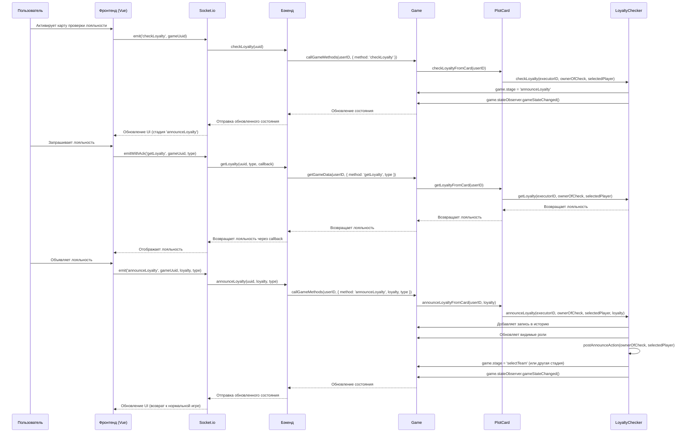

# Интеграция механизма проверки лояльности с UI для plot cards

## Текущая реализация взаимодействия с UI для проверки лояльности

В текущей реализации взаимодействие с UI для проверки лояльности происходит следующим образом:

1. **Бэкенд**:

   - Обработчики событий сокетов в `main/index.ts`:

     ```typescript
     socket.on('checkLoyalty', (uuid) => {
       console.log(`Player ${userName} checkLoyalty in game ${uuid}`);
       getRoomManager(uuid).callGameMethods(userID, { method: 'checkLoyalty' });
     });

     socket.on('announceLoyalty', (uuid, loyalty, type) => {
       console.log(`Player ${userName} announceLoyalty in game ${uuid}`);
       getRoomManager(uuid).callGameMethods(userID, { method: 'announceLoyalty', loyalty, type });
     });

     socket.on('getLoyalty', (uuid, type, cb) => {
       console.log(`Player ${userName} getLoyalty in game ${uuid}`);
       cb(getRoomManager(uuid).getGameData(userID, { method: 'getLoyalty', type }));
     });
     ```

   - Обработка в `GameManager`:

     ```typescript
     handleLoyaltyAction(
       userID: string,
       method: 'checkLoyalty' | 'announceLoyalty',
       params?: { loyalty: TLoyalty | TRoles; type: TLoyaltyType },
     ) {
       if (this.game.addons.witch && (this.game.stage === 'witchLoyalty' || params?.type === 'witch')) {
         if (method === 'checkLoyalty') {
           this.game.addons.witch.checkLoyalty(userID);
           return;
         } else if (method === 'announceLoyalty' && params) {
           this.game.addons.witch.announceLoyalty(userID, params.loyalty);
           return;
         }
       }

       if (this.game.addons.ladyOfLake) {
         if (method === 'checkLoyalty') {
           this.game.addons.ladyOfLake.checkLoyalty(userID);
           return;
         } else if (method === 'announceLoyalty' && params) {
           this.game.addons.ladyOfLake.announceLoyalty(userID, params.loyalty);
           return;
         }
       }

       if (this.game.addons.ladyOfSea) {
         if (method === 'checkLoyalty') {
           this.game.addons.ladyOfSea.checkLoyalty(userID);
           return;
         } else if (method === 'announceLoyalty' && params) {
           this.game.addons.ladyOfSea.announceLoyalty(userID, params.loyalty);
           return;
         }
       }
     }
     ```

2. **Фронтенд**:

   - Компонент `AnnounceLoyalty.vue` для объявления лояльности:

     ```typescript
     const announceLoyalty = (loyalty: TLoyalty | TRoles) => {
       socket.emit('announceLoyalty', gameState.value.uuid, loyalty, type);
     };
     ```

   - Получение лояльности:

     ```typescript
     loyalty.value = await socket.emitWithAck('getLoyalty', gameState.value.uuid, type);
     ```

   - Проверка лояльности через панель действий:
     ```typescript
     <v-btn color="warning" :disabled="!isCheckAvailable" @click="emitClick('checkLoyalty')">
       {{ $t('inGame.checkLoyalty') }}
     </v-btn>
     ```

## План интеграции с UI для plot cards

Для интеграции механизма проверки лояльности с UI для plot cards необходимо:

### 1. Расширение типов для TLoyaltyType

Добавим новые типы для карт plot cards:

```typescript
// packages/types/game/addons/loyalty.ts
export type TLoyaltyType = 'witch' | 'lady' | 'showNature' | 'areYouTheOne' | 'showStrength' | 'weFoundYou';
```

### 2. Расширение обработчиков в GameManager

Добавим обработку событий проверки лояльности для plot cards:

```typescript
// packages/backend/src/core/game-manager/index.ts
handleLoyaltyAction(
  userID: string,
  method: 'checkLoyalty' | 'announceLoyalty',
  params?: { loyalty: TLoyalty | TRoles; type: TLoyaltyType },
) {
  // Существующий код для witch, ladyOfLake, ladyOfSea...

  // Добавляем обработку для plot cards
  if (this.game.addons.plotCards && this.game.addons.plotCards.activeCard) {
    const card = this.game.addons.plotCards.activeCard;

    if (card.loyaltyChecker &&
        (card.name === 'showNature' ||
         card.name === 'areYouTheOne' ||
         card.name === 'showStrength' ||
         card.name === 'weFoundYou')) {

      if (method === 'checkLoyalty') {
        this.game.checkLoyaltyFromCard(userID);
        return;
      } else if (method === 'announceLoyalty' && params) {
        this.game.announceLoyaltyFromCard(userID, params.loyalty);
        return;
      }
    }
  }
}

getGameData(userID: string, params: TGetLoyaltyParams): TLoyalty | TRoles {
  switch (params.method) {
    case 'getLoyalty':
      // Существующий код для witch, ladyOfLake, ladyOfSea...

      // Добавляем обработку для plot cards
      if (this.game.addons.plotCards && this.game.addons.plotCards.activeCard) {
        const card = this.game.addons.plotCards.activeCard;

        if (card.loyaltyChecker &&
            (card.name === 'showNature' ||
             card.name === 'areYouTheOne' ||
             card.name === 'showStrength' ||
             card.name === 'weFoundYou')) {

          return this.game.getLoyaltyFromCard(userID);
        }
      }

      break;
  }

  throw new Error(`Unknown method ${params.method}`);
}
```

### 3. Модификация компонентов UI для поддержки plot cards

Необходимо модифицировать компоненты UI для поддержки проверки лояльности через plot cards:

```typescript
// packages/ui/src/components/view/board/modules/PlotCardActions.vue (новый компонент)
<template>
  <div v-if="isLoyaltyCheckCard">
    <div v-if="stage === 'checkLoyalty' || stage === 'revealLoyalty'">
      <v-btn color="warning" :disabled="!isCheckAvailable" @click="checkLoyalty">
        {{ $t('inGame.checkLoyalty') }}
      </v-btn>
    </div>
    <div v-else-if="stage === 'announceLoyalty'">
      <AnnounceLoyalty :type="cardName" />
    </div>
  </div>
</template>

<script setup lang="ts">
import { computed } from 'vue';
import { useSocket } from '@/api/socket';
import { TPlotCardNames } from '@avalon/types';
import AnnounceLoyalty from '@/components/view/board/game/modules/AnnounceLoyalty.vue';

const props = defineProps<{
  cardName: TPlotCardNames;
  stage: string;
  gameUuid: string;
}>();

const socket = useSocket();

const isLoyaltyCheckCard = computed(() => {
  return ['showNature', 'areYouTheOne', 'showStrength', 'weFoundYou'].includes(props.cardName);
});

const isCheckAvailable = computed(() => {
  // Логика проверки доступности кнопки проверки лояльности
  return true;
});

const checkLoyalty = () => {
  socket.emit('checkLoyalty', props.gameUuid);
};
</script>
```

### 4. Интеграция с существующими компонентами

Интегрируем новый компонент с существующими компонентами для отображения карт:

```typescript
// packages/ui/src/components/view/board/game/modules/PlotCard.vue (модификация)
<template>
  <div class="plot-card">
    <div class="card-info">
      
      <div class="card-name">{{ $t(`cardsInfo.${card.name}`) }}</div>
    </div>

    <PlotCardActions
      v-if="card.stage === 'active'"
      :cardName="card.name"
      :stage="gameState.stage"
      :gameUuid="gameState.uuid"
    />
  </div>
</template>

<script setup lang="ts">
import { computed } from 'vue';
import { TPlotCardNames } from '@avalon/types';
import PlotCardActions from '@/components/view/board/modules/PlotCardActions.vue';

// Остальной код...
</script>
```

### 5. Обновление логики выбора игроков

Обновим логику выбора игроков для проверки лояльности в plot cards:

```typescript
// packages/backend/src/core/game/addons/plot-cards/loyalty-checker.ts
initCheckLoyalty(): void {
  // Установка стадии игры и ожидание действия от владельца карты
  this.game.stage = this.stageToCheck;

  const owner = this.game.findPlayerByID(this.card.ownerID!);
  owner.features.waitForAction = true;

  // Настройка selectAvailable для выбора игрока
  // В зависимости от типа карты, логика выбора может отличаться
  switch (this.card.name) {
    case 'showNature':
      // Владелец карты может выбрать любого игрока
      this.game.selectAvailable[this.stageToCheck] = (player) =>
        player.user.id !== this.card.ownerID;
      break;
    case 'areYouTheOne':
      // Владелец карты может выбрать только соседних игроков
      this.game.selectAvailable[this.stageToCheck] = (player) => {
        const owner = this.game.findPlayerByID(this.card.ownerID!);
        return player === owner.next || player === owner.prev;
      };
      break;
    case 'showStrength':
      // Лидер может выбрать любого игрока
      this.game.selectAvailable[this.stageToCheck] = (player) =>
        player.user.id !== this.card.ownerID && player !== this.game.leader;
      break;
    case 'weFoundYou':
      // Владелец карты может выбрать любого игрока в команде
      this.game.selectAvailable[this.stageToCheck] = (player) =>
        player.features.isOnMission === true && player.user.id !== this.card.ownerID;
      break;
    default:
      // По умолчанию владелец карты может выбрать любого игрока
      this.game.selectAvailable[this.stageToCheck] = (player) =>
        player.user.id !== this.card.ownerID;
  }

  this.game.stateObserver.gameStateChanged();
}
```

### 6. Обновление локализации

Добавим новые строки локализации для поддержки проверки лояльности через plot cards:

```typescript
// packages/ui/src/i18n/langs/ru.ts (и другие языки)
export default {
  // Существующие строки...

  plotCardsLoyalty: {
    showNatureCheck: 'Выберите игрока, которому хотите показать свою лояльность',
    areYouTheOneCheck: 'Выберите соседнего игрока для проверки лояльности',
    showStrengthCheck: 'Выберите игрока, которому хотите показать свою лояльность',
    weFoundYouCheck: 'Выберите игрока в команде, который должен сыграть карту лицом вверх',

    showNatureAnnounce: 'Объявите лояльность игрока {player}',
    areYouTheOneAnnounce: 'Объявите лояльность игрока {player}',
    showStrengthAnnounce: 'Объявите свою лояльность игроку {player}',
    weFoundYouAnnounce: 'Игрок {player} должен сыграть карту лицом вверх',
  },

  // Другие строки...
};
```

## Диаграмма взаимодействия с UI



## Преимущества этого подхода

1. **Единый механизм проверки лояльности**: Все карты и аддоны используют один и тот же базовый механизм проверки лояльности.
2. **Гибкость**: Каждая карта может настроить свою логику выбора игроков и обработки результатов.
3. **Расширяемость**: Легко добавлять новые карты или аддоны, которые используют механизм проверки лояльности.
4. **Консистентный UI**: Пользовательский интерфейс для проверки лояльности одинаков для всех карт и аддонов.
5. **Улучшенный пользовательский опыт**: Игроки будут иметь интуитивно понятный интерфейс для взаимодействия с картами проверки лояльности.
