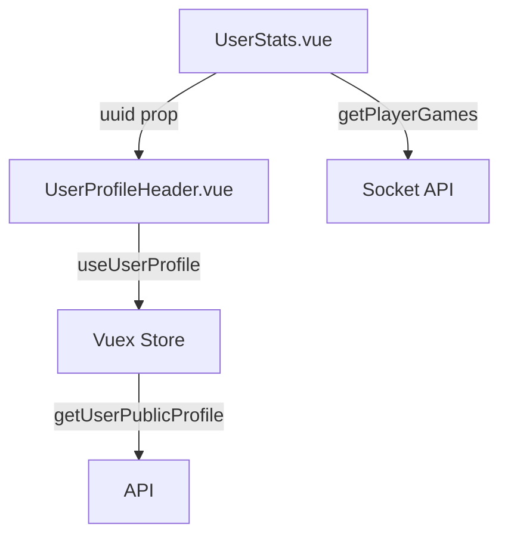

# Refactoring User Profile Loading in UserStats.vue

## Problem Statement

Currently, the UserStats.vue component uses a different approach for loading user profile data compared to other components in the application:

- Most components use the `useUserProfile` composable
- UserStats.vue directly dispatches a store action and uses a computed property

This inconsistency makes the code harder to maintain, especially when the uuid changes while on the UserStats page.

## Solution Plan

### 1. Create a New UserProfileHeader Component

Create a new component called `UserProfileHeader.vue` in the `packages/ui/src/components/stats/` directory:



#### Component Specifications:

- **Location**: `packages/ui/src/components/stats/UserProfileHeader.vue`
- **Props**:
  - `uuid` (String, required): The user ID
  - `gameStats` (Object, required): The game statistics object containing wins, losses, and winrate
- **Functionality**:
  - Use the `useUserProfile` composable to load user profile data
  - Display the user's avatar, name, and ID
  - Display game statistics (wins, losses, winrate)
  - Handle loading states appropriately

#### Component Template Structure:

```vue
<template>
  <div v-if="userState.status === 'ready'" class="preview-profile">
    <Avatar class="avatar mr-2" :avatarID="userState.profile.avatar" />
    <div class="profile-info">
      <div class="profile-username">
        {{ userState.profile.name }}
      </div>
      <div class="info-hint">id: {{ uuid }}</div>
      <div class="profile-games">
        <div class="profile-games-counter">
          <span class="games-wins">
            {{ gameStats?.teams.total.wins }}
          </span>
          -
          <span class="games-loses">
            {{ gameStats?.teams.total.lose }}
          </span>
        </div>
        <div class="info-hint">games</div>
      </div>
      <div>
        <div class="profile-winrate">
          {{ `${gameStats?.teams.total.winrate} %` }}
        </div>
        <div class="info-hint">winrate</div>
      </div>
    </div>
  </div>
  <div v-else class="preview-profile-loading">
    <v-skeleton-loader type="image, text" />
  </div>
</template>
```

#### Component Script:

```js
import { defineComponent } from 'vue';
import Avatar from '@/components/user/Avatar.vue';
import { useUserProfile } from '@/helpers/setup';

export default defineComponent({
  name: 'UserProfileHeader',
  components: {
    Avatar,
  },
  props: {
    uuid: {
      type: String,
      required: true,
    },
    gameStats: {
      type: Object,
      required: true,
    },
  },
  setup(props) {
    const { userState } = useUserProfile(props.uuid);

    return {
      userState,
    };
  },
});
```

### 2. Modify UserStats.vue

Update the UserStats.vue component to:

- Remove the direct store dispatch for user profile data
- Remove the computed userState property
- Import and use the new UserProfileHeader component
- Pass the uuid and game stats props to the UserProfileHeader component

#### Changes to UserStats.vue:

1. **Template Changes**:

   - Replace the current profile display section with the new component

   ```vue
   <UserProfileHeader :uuid="$props.uuid" :gameStats="state" />
   ```

2. **Script Changes**:
   - Import the new component
   - Remove the userState computed property
   - Remove the store dispatch in the initState function
   - Add the new component to the components list

### 3. CSS Considerations

- Move the CSS related to the profile display from UserStats.vue to UserProfileHeader.vue
- Ensure consistent styling between the old and new implementations

## Benefits

1. **Consistency**: Uses the same approach for user profile data loading across the application
2. **Maintainability**: Separates concerns, making the code easier to maintain
3. **Reactivity**: The useUserProfile composable will automatically handle changes to the uuid
4. **Reusability**: The new component can be reused in other parts of the application if needed

## Implementation Steps

1. Create the new UserProfileHeader.vue component
2. Modify UserStats.vue to use the new component
3. Test the changes to ensure everything works as expected, especially when navigating between different user stats pages
4. Verify that the profile data is loaded correctly and displays properly
